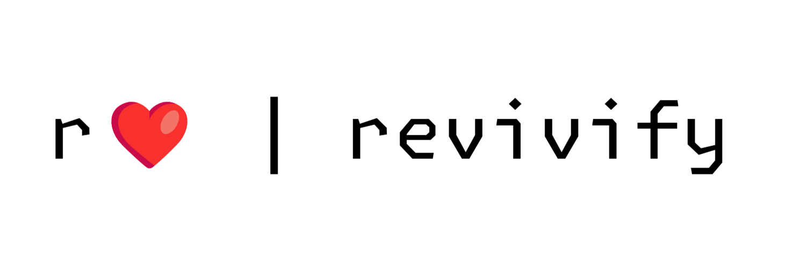

## Breathing New Life into Open Source
   

Revivify is a platform dedicated to the systematic revival of valuable but abandoned open-source projects. 

For a deeper understanding of Revivify, explore these documents:

- [Core](core.md) - What Revivify does and how it works
- [Concept](concept.md) - The vision behind Revivify and the problems it solves
- [Philosophy](philosophy.md) - The principles and values that guide Revivify

## Community

Revivify is more than a platform — it's a community dedicated to nurturing open source software. We're bringing together:

- New & experienced developers
- Maintainers who need support or transition paths for their projects
- Organizations that depend on the long-term health of the open source ecosystem

We can work together to build a more sustainable future for open source — one where valuable projects aren't simply abandoned, but have paths to revival and ongoing maintenance.

## Join Us

Help us build a more sustainable future for open source. Please express your interest, anyone can get involved.

## License

Revivify is licensed under the [MIT License](LICENSE).

---

*Revivify is currently in alpha development. We welcome early interest and feedback as we prepare for to . contact@revivify.dev*
